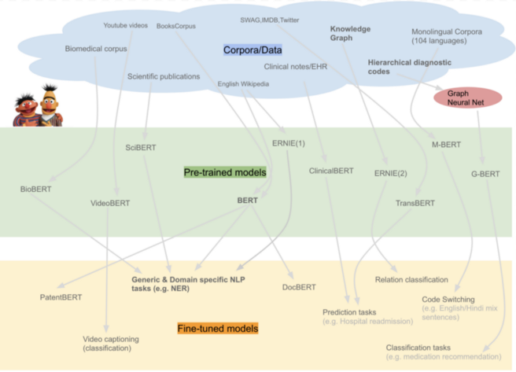
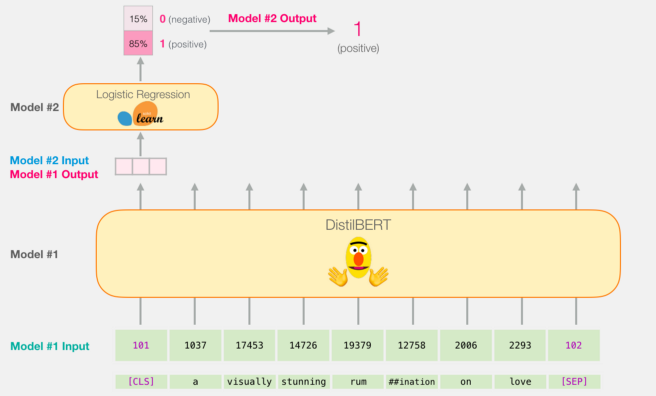

# Prediction the sentiments of Coronavirus tweets from May 1st 2020 till June 12th 2020 using neural networks

At first there is presentation of the project and then Description about implementation.
 
 
 
 
## Presentation of the project

#### The project aims to train an ensemble classification model by fine-tuning three different models to predict the sentiments of tweets related to coronavirus. The models that are being used are the BERT embedding model, ELMo embedding model, and XLNet embedding model.

### Authors
Behrad Moeini           behrad@ut.ee 
Navid Bamdad Roshan     navid.bamdadroshan@gmail.com 
Hasan Mohammed Tanvir   hasantanvir79@gmail.com 

### Training dataset
The dataset for training the model is composed of two different datasets. Those two datasets got merged to have more data to train the model. However, before training the model using the dataset, the dataset has been modified. One of the modifications was to delete links, mentions, emoticons. Also, the distribution of the tweets over different sentiments is not uniform. Also, there are too many sentiments in the dataset, as can be seen in figure 1. This unbalanced dataset hurts accuracy, so there should be a modification in the dataset to overcome. Two steps solve the issue. The first step was to merge some of the sentiments which are related together. For instance, “worry” and “fear” or “disgust” and “hate” can be merged due to their close meaning. Combining some of the labels got better but not good enough; the sentiment distribution of this stage is presented in figure 2. Then, in the next step, the dataset is balanced by over/under-sampling instances of each class to approximate the uniform distribution. The result is shown in figure 3. To conclude, the training dataset has 64,000 instances and eight classes, namely neutral, sadness, surprise, worry, happiness, hate, relief, and anger.
  
<figure>
  
  <figcaption>Fig.1,2,3 - Sentimen distribution of train dataset.</figcaption>
</figure>
  

### Collecting tweets about coronavirus
The tweets related to coronavirus are gathered using tweeter API. The tweets are from the United States of America and between May 1, 2020, and June 12, 2020. 750,000 tweets have been collected from tweeter to be predicted by the proposed models.
  

### Pre-processing the collected tweets
Pre-processing the data can be considered as the most important part of utilizing prediction models. Accordingly, the gathered tweets must be cleaned before being predicted by the models. As a result, the data is cleaned by removing links, mentions, and emoticons that are not understandable by embedding models. Also, all tweets have been lower-cased in the pre-processing stage.
  

### XLNet embedder
XLNET is a bidirectional generalized autoregressive model. In a simple word, it means that the next token is dependent on all previous tokens. It integrates the idea of auto-regressive models and bi-directional context modeling. In the process of implementing XLNET,  
The fast-bert package is used to implement the XLNet network. The description of the fast-bert says, “Fast-Bert is the deep learning library that allows developers and data scientists to train and deploy BERT and XLNet based models for natural language processing tasks beginning with Text Classification.”
 
The hyperparameters of the model are as follows.
 
Number of epochs = 20
Batch size = 128
Dropout rate = 0.1
Optimizer type= lambLearning rate = 0.0001
batch_size_per_gpu = 128
max_seq_length= 16Learning rate = 0.0001
pretrained model= xlnet-base-cased
Optimizer = lamb
Learning rate = 1e-4
 
The result of the model can be seen in Figure 3.3.

<figure>
  
  <figcaption>Fig.4</figcaption>
</figure>
  

### ELMo embedder
The next embedding model that has been used is the ELMo model. This model gets a sentence as input and gives 1024 features as output. So, fine-tuning can be done by adding some layers after ELMo embedding layer to construct the model. Accordingly, the constructed neural network structure is presented in figures 5.1 and 5.2.
  

<figure>
  
  <figcaption>Fig.5.1</figcaption>
</figure>
  

<figure>
  
  <figcaption>Fig.5.2</figcaption>
</figure>
  

The hyperparameters of the model are as follows.
  

Number of epochs = 25
Batch size = 32
Dropout rate = 0.4
Optimizer = Adam
Learning rate = 1e-4
Regularization = L2
Regularization rate = 1e-3
  

And the training history of the model is presented in figure 6.1.
  

<figure>
  
  <figcaption>Figure.6.1 Training history of ELMo model fine-tuning</figcaption>
</figure>
  

<figure>
  
  <figcaption>Figure.6.2 ELMo model accuracy</figcaption>
</figure>
  

### BERT embedder
One of the latest milestones in natural language processing is the development of BERT which is known as Bidirectional Encoder Representations from Transformers. BERT’s pivotal innovation is applying the bidirectional training of Transformer, a popular attention model, to language modeling. This is in different to previous innovations which only looked at a text sequence either from left to right (sequential) or combined left-to-right and right-to-left training. The detailed structure of the model is enormous and complicated, therefore a brief description of the model is given below.
  
BERT-Base, Uncased: 12-layers, 768-hidden, 12-attention-heads, 110M parameters
  
There is another BERT model available under Google’s open-source git reporsitory (hyperlink), BERT-Large which is large in size compared to BERT-Base. In order to decrease the computational complexity, a smaller model, BERT-Base, has been chosen for this specific task.
  
<figure>
  
  <figcaption>Figure.7. Use-case and hi-level architecture of BERT [Ref: mc.ai]</figcaption>
</figure>
  

But the model does not itself give output in the desired format. One has to put another layer on top of BERT based on the specific use-case. The following figure illustrates various fields where BERT can be used.
  

#### How the pipeline works

From the figure above it is visible that the middle layer is pretrained which is BERT-Base model in this specific use case. This means that the model is already trained on a corpus of data and it gives a list of vector of shape 768 as output. The process till this part is known as pretraining and the next part where the vector output is taken as input in the next layer (multiclass classification in this specific case of emotion classification) is known as fine tuning based on annotated data. The classifier trained of the annotated data is known as fine tuned model and the output this layer gives is in the shape of the desired output the user wants.
  

The scope of the project for this section is only to prepare the fine-tuned models which means the classifier layer will be trained on annotated dataset. The classifier layer houses softmax activation function.
  

<figure>
  
  <figcaption>Figure.8. Jay Alammar showed how the BERT (DistilBERT is a type of BERT model) takes tokenized values as input and assign the ids for each of the tokenized words. The output from BERT layer is a vecotor of size 768 for each id which later is propagated to the classification layer (Linear Regression here) and followed by an output.</figcaption>
</figure>
  

For example, in the specific case, the dataset that will be used to train the classifier has 8 labels. So the classifier will give output of array of shape (1, 8) for one instance. The 8 columns will hold float value for different classes and the column that has the maximum score represents the label.
 

For training the classifier layer the following parameter has been used:
 

Number of epochs = 3 , Train Batch size = 32 , Predict Batch Size=8, Eval Batch size=8, Dropout rate = 0.1, Learning rate = 5e-5, max_seq_length=128, Current accuracy of the model after 3 epochs of: training_accuracy = 89% test_accuracy=65%
 

High Performance Computing (HPC) of University of Tartu was used to train the classification layer for BERT.
  

### Ensembling the models
To ensemble the models, the predicted results of the models are aggregated. This aggregation is done by prioritizing the models based on their test accuracy. Accordingly, XLNet model gets the score of 55 because it has the test accuracy of around 55%, ELMo model gets the score of 60 because it has the test accuracy of around 60%, and BERT model gets the score of 65 because it has the test accuracy of around 65%. After predicting the tweets by each of the models, the results are aggregated based on the scores. In the end, the class that has the most score is chosen as the predicted label for that instance.
 

The accuracy of the ensemble model on test data is 65.25% which is slightly less than the accuracy of BERT model on test data. More detailed information about the result of ensembling can be found as follows.
 

The ensembled model is -0.23% more accurate than the BERT model.
The ensembled model is 5.02% more accurate than the ELMo model.
The ensembled model is 11.23% more accurate than the XLNet model.
 

The BERT model labels are 90.96% similar to ensembled model labels
The ELMo model labels are 73.08% similar to ensembled model labels
The XLNet model labels are 69.39% similar to ensembled model labels
  

### Predicting the tweets about coronavirus using ensembled model
As it is previously mentioned, the tweet data about coronavirus has been gathered from Twitter, and there are 750,000 tweets in the dataset.
 

The expected result is to show how mass sentiment works during special cases like COVID-19 pandemic. Since there are 8 emotion classes labeled as ‘relief’, ‘neutral’, ‘worry’, ‘surprise’, ‘happiness’, ‘hate’, ‘sadness’, ‘anger’, the idea is to visualize how emotions change over a period of time in specific demography, in this case, the USA.
 

After ensembling, the accuracy has been slightly reduced compared to the best performing model, BERT by Jacob D. et al., Google’s researchers. For the sake of the experiment and the possibility that in future use-cases ensemble may perform better, the decision was to predict using the ensemble method.
 

Although the aggregated tweeter data over 15 days counts to 750,000 tweets but for some reason yet unknown to the group, BERT tends to drop the first instance and predict from the following ones, as a result, the predicted labels counts to 749,999 where each day has its fair share of the emotion labels. The following bar plot shows the progression of emotion over a period of time.
 

Results: https://youtu.be/Oe0PAKtvYf8
  

From the video, it is visible how in the beginning, May-01, mass USA population were worried and surprised. A slight percentage of population also felt relieved, hatred, and neutral. A significant amount of population were happy, angry, and sad at the same time.
 

In the progression it is visible that slowly the happy feeling is waning, so is surprise, on the other hand negative feeling, such as anger, sadness, hate is growing around May 22 when the COVID-19 situation was getting worse in the USA.
 

One interesting fact is that ‘relief’ emotion is decreasing gradually as May ends and except for a small spike in the middle around May 13 and again disappeared on May 31 and remained so until May 12.
  

### Conclusion

The objective of this project was to demonstrate how the mass psyche acts in various situations. If interested individual wants, they can apply the model to predict different emotions based on any type of data. One can also take a reliable sample size and predict the happy index of population indirectly, after all we reflect our emotion through words most of the times. It can also be implemented by law enforcement agencies to check how the population behaves based on which they can act accordingly. In the future implementation, the classification layer can be modified for better result. A complete pipeline could be built so that user can easily upload the data in a web UI and directly get the result.
  
  
  
  

# Description about running the project

### Merging train datasets
In the folder Dataset, Combine_script.py script is used to merge two datasets, merge some sentiments like fear and worry together, clean the data and balance the dataset.
 
Then Test_train_split.py script can be used to split the dataset to train data and test data.
  

### Collecting the tweets
in the "Tweet collection" folder, "search 7days gather.py" script can be used to collect tweet from twitter using API. Twitter keys must be added to the script before running the script.
 
Then "Data cleaner.py" script can be used to clean the collected tweets.
  

### Fine-tuning the XLNet model
XLNet fine-tuning has been done manually so far and we are planning to fine-tune it using the fast-bert package as well.

  

### Prediction using the XLNet model
The "xlnet.ipynb" and the file expected to predict should be in the same folder. Also, the tweet text column should named as text and the sentiment column should be named as label.

  

### Fine-tuning the ELMo model
Inside the ELMo folder, "Train ELMo fine-tune model.ipynb" notebook can be used to fine tune the ELMo model for this project. Network structure and the hyperprameters can be modified in the notebook. 
 
The network is trained for 25 epocks and the trained weights are in the "elmo-0-epoch-25.h5" file. 
 
"logs-0.csv" file contains the training history of the network.
  

### Prediction using the ELMo model
The weights in the "elmo-0-epoch-25.h5" file is used by "Predict ELMo fine-tuned model.ipynb" notebook to create the neural network and predict the sentiments of texts using ELMo embedder and fine-tuned layers.
  

### Fine-tuning the BERT model

  

### Prediction using the BERT model

  

### Ensembling the results of three models
Inside the "Ensembling" folder, "Ensemble test data.ipynb" notebook can be used to ensemble the test data prediction results of three models and evaluate the ensemble model on test data. This notebook also reports some more information about ensembled model and compare it with the each of the seperate models.
 
"Ensemble collected tweets.ipynb" notebook can be used to ensemble the prediction results of collected data that are predicted by above mentioned three models and get the prediction result of the ensemble model.

